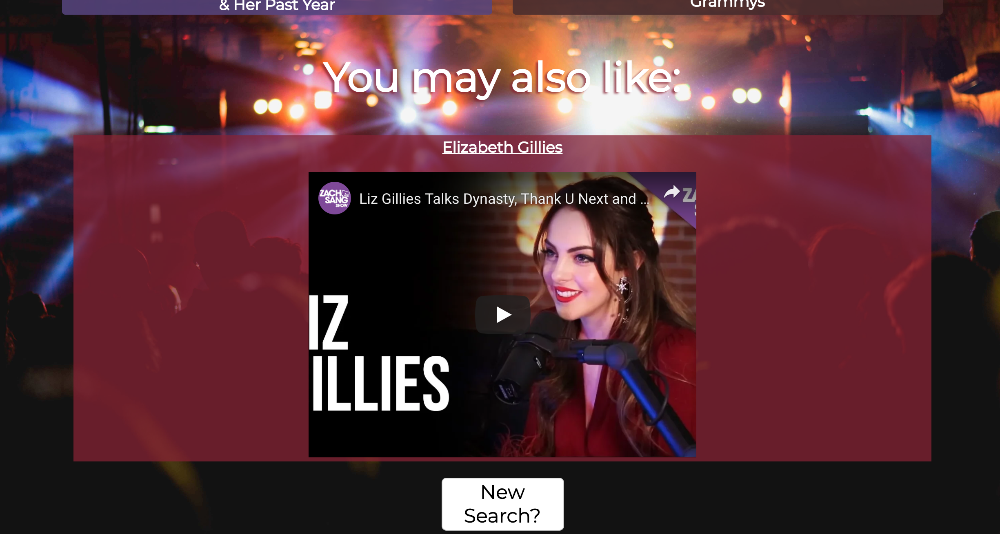

# Big Music Guy

Live app can be viewed here: <a href="https://bahitssara.github.io/Big-Music-Guy/" target="_blank">Live App</a>

## Motivation
I've always believed that music means more to people when they can connect with the artist. I wanted to create a web app for music lovers like myself, that allows them to learn more about the artist behind that music so they can grow their love for it, and maybe even discover new musicians while their at it! 

## Screenshots

### Start Screen

### Search Page

### Search Results
 

## Summary
This web app gives users the opportunity to search a musician, band, music group, etc. Once they make a search, the app returns recent video interviews, news articles, and gives recommendations for similar artists. Users are able to watch the Youtube interviews in the app itself, and link to the news webpages to read the articles on their local sites. The recommendations provide the user with the most relevant Youtube music videos,and also provides a bio synopsis for that artist via Wikipedia. Once finished with that artist they can return to the search bar to start all over! 

## Built With
    -HTML
    -JavaScript
    -CSS
    -jQuery

